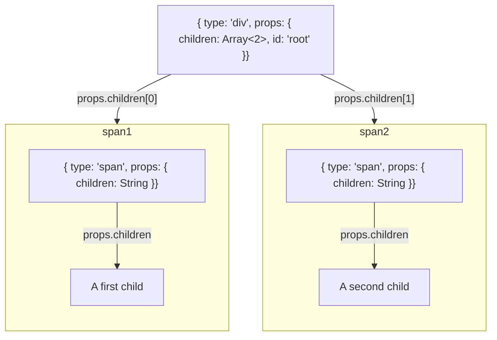

# JSX

JSX is a convenient format for writing HTML like code while keeping all the power of JavaScript.

In your day to day tasks with React, you probably rarely stop to think how it all looks like under the hood...

but today is a different day, if we want to create our own React, we will need to understand how JSX looks like once it has been
transformed.

## A simple example: HTML tag

To start getting into understanding JSX, let's start with a super simple example: a single HTML tag.

Let's take the following JSX as an example:
```js
<div />
```

This will be transformed by the Webpack setup from `create-react-app` to a JS structure that we should be able to use to generate our final HTML, namely, for what we are really interested in, it'll look something like:

```js
{
    type: 'div'
}
```

What about a different tag, for example:
```html
<span />
```

will be transformed to

```js
{
    type: 'span'
}
```

Alright, we can see a pattern emerging.


## What about props?

A really important part of React (and HTML) is the fact we can pass along props (in HTML the name `attributes` tends to be used) to update the way a specific tag behaves/is displayed/is used, for example the `id` HTML attribute allows to create a unique ID for a tag.

This looks like this in HTML:
```html
<div id="test"></div>
```

And would look very similar in JSX:
```html
<div id="test" />
```

In the case of JSX, it will be transformed to the following JS structure:

```js
{
    type: 'div',
    props: { id: 'test' }
}
```

What about more attributes?

```html
<div id="test" tabIndex={5} />
```

will become 

```js
{
    type: 'div',
    props: { id: 'test', tabIndex: 5 }
}
```

Most props that describe HTML attributes use the same exact naming as their HTML counterparts, but there are a few exceptions.

`className` is a famous one (the HTML attribute is `class`), and stems from the fact `class` is a reserved keyword in JavaScript to create a class in the Object Oriented Programming sense.
For some others it has been preferred by the React team to use the standard JavaScript camelCase as opposed to the HTML kebab-case, for example in JSX we normally write `acceptCharset` as opposed to `accept-charset`.
While `accept-charset` wouldn't be forbidden to be written in JavaScript, it is generally not practical to write as an object, as it forces developers to always access the key as a string given JavaScript doesn't support `-` in variable names.

Example:
```js
// Those are easy to write
const props = { acceptCharset: 'utf-8' };
const { acceptCharset } = props;

// Those are a bit more annoying
const props = { 'accept-charset': 'utf-8' };
const acceptCharset = props['accept-charset'];
```

## What about children?

HTML (and JSX) in general become much more powerful once they allow us to create a structured hierarchy of elements.
In both cases, the elements are called children.

First in HTML, a `div` with two `span` children would look like the following:
```html
<div id="root">
    <span>A first child</span>
    <span>A second child</span>
</div>
```

and in JSX... the same thing
```html
<div id="root">
    <span>A first child</span>
    <span>A second child</span>
</div>
```

Now though our JS structure starts to be a little more complex to comprehend, because it involves nesting, so instead of looking straight at the JS object, let's look at a diagram of it first:



and the JavaScript object:

```js
{
    type: 'div',
    props: {
        children: [{
            type: 'span',
            props: { children: 'A first child' }
        }, {
            type: 'span',
            props: { children: 'A second child' }
        }],
        id: 'test'
    }
}
```

## What about components?

Now a major difference between HTML and JSX is the fact JSX enables us to write components.
In recent versions of React, most components are written as functional components, meaning our components are all JavaScript functions.

Their signature is to take props as arguments in and output something that is renderable: JSX!

Let's look at an example component

```js
const MainTitle = ({ title }) => {
    return <h1 className="main-title">{title}</h1>;
};
```

We would use such a component in JSX in the following way

```html
<MainTitle title="Build your own (simple) React!" />
```

And this would be transformed to the following JSX structure:

```js
{
    type: MainTitle,
    props: { title: 'Build your own (simple) React!' }
}
```

where the `MainTitle` type is the function we defined as our component.

Now that's a bit more mysterious than what we have seen so far, as a function is not something we exactly now how to render...

So let's think about the problem again, we have a function component, which expects props as arguments and outputs JSX.
And in the JSX we receive, we have as our type that function component, and the props in an object...

And in the end, we would like to have the JSX rendered by the component.

<details>
    <summary>Spoiler: How do we make function components work?</summary>

    What if we just called the function with the props from the object returned by the JSX parser?

```js
    const jsxForAComponent = <MainTitle title="Build your own (simple) React!" />;
    console.log(jsxForAComponent);
    /*
    logs
    {
        type: MainTitle,
        props: { title: 'Build your own (simple) React!' }
    }
    */
    const FunctionComponent = jsxForAComponent.type;
    const componentChildren = FunctionComponent(jsxForAComponent.props);
    console.log(componentChildren);
    /*
    logs
    {
        type: 'h1',
        props: { children: 'Build your own (simple) React!', className: 'main-title' }
    }
    */
```
</details>

That's a wrap on handling all sort of JSX, now we should be ready to render our React app to the DOM statically!