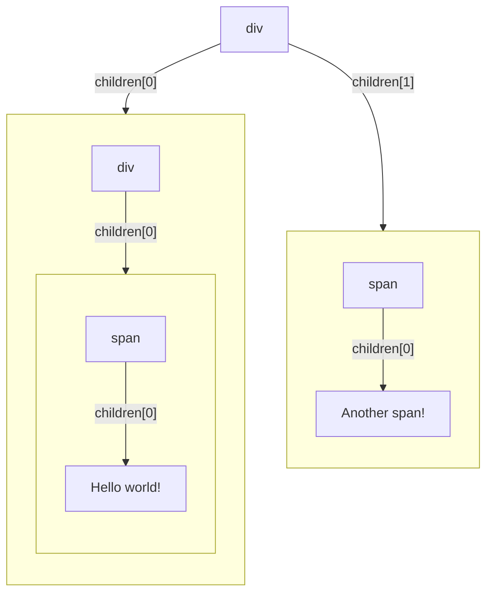
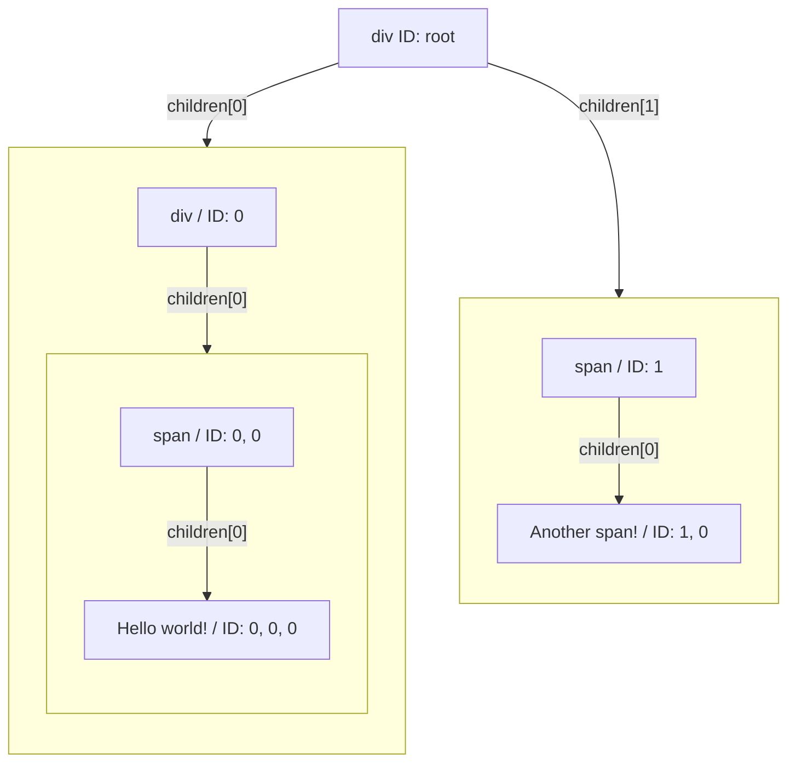

# VDOM

The VDOM, for Virtual DOM, is a DOM like structure used to help us in keeping tracks of changes in the component tree.
It is useful for two primary reasons:
- It can be used to keep track of our hooks states throughout renders
- It can allow us to apply targeted updates to the DOM to improve performances

## How will our VDOM look like

Based on the two primary reasons we want to have a VDOM, we need to have a structure that allows us to refer to elements by their position within the tree and where retrieval of said elements is simple enough.

We will need to be able to have a kind of ID for each element within the VDOM, which will be based on their position within the tree.

Let's think about an example:

```html
<div>
    <div>
        <span>
            Hello world!
        </span>
    </div>
    <span>
        Another span!
    </span>
</div>
```

In this simple example, we have 3 nodes, two are HTML tags, one is a primitive node "Hello world!".

If we think about IDs as positions within the tree, we would need to find a way to reference each of those that can be replicated over time...

Let's think about the DOM above as a tree, it looks like this:



Given we want to use positions to identify the DOM elements, we could denote each of them based on their position from the root.



Given the main goal of those "id"s are to help us access the different elements within our VDOM, we will refer to them as "pointer"s from now on, as using them we can point to a specific element within our VDOM.

## The different type of elements in our structure

For most of the elements in the structure, we can handle them within our DOM handlers rendering method and they ultimately result in things that can be rendered to the DOM.

For example, tag elements are rendered as their type in the dom, and their props are applied to the HTML tag element.
For primitive types, we most of the times render them as text nodes, except for `undefined`/`false` which we don't render (but will need to keep track of in the future so we can better apply node additions/removals).

The more puzzling piece is Functional Components, while they are super useful to reuse code and will in the future allow us to use hooks, they aren't very useful to our DOM handlers renderer as they aren't elements that can be rendered in the DOM.

This marks the distinction we will do from now on between:
1. The "regular" VDOM that we will track in our `index`, for which we will keep a current and previous version and will keep track of all elements including components
2. The "renderable" VDOM, which excludes functional components in favor of their renderable children, as the components themselves aren't very useful to the DOM renderer

Let's look at an example, given the following JSX

```html
<div>
    <h1> Build your own (simple) React!</h1>
    <section>
        <Counter />
    </section>
</div>
```

and the following Counter component

```js
const Counter = () => {
    const [count, setCount] = useState(0);

    return (
        <div>
            <span>The count is {count}</span>
            <button onClick={() => setCount(count => count + 1)}>+</button>
        </div>
    );
}
```

our final DOM in the browser should look like this on the first render

```html
<div>
    <h1> Build your own (simple) React!</h1>
    <section>
        <div>
            <span>The count is 0</span>
            <button>+</button>
        </div>
    </section>
</div>
```

In the rendered version, components are not part of the picture, but we will still need to keep track of them in our full VDOM so that we can process diff and keep hooks state correctly.

## Data structure of our VDOM

We need to create a data structure that will allow us to keep in memory our VDOM and set/retrieve elements from it given a specific pointer.
We also need to keep components within it, as we will need to know when they appeared or when they are removed from the tree to correctly handle their hooks.

We decided to use the following structure for the full VDOM:

```mermaid
flowchart
    direction TB
    div["{ element: { type: 'div', props: {...}, VDOMPointer: [] }, renderedChildren: Array<2> }"]
    h1["{ element: { type: 'h1', props: {...}, VDOMPointer: [0] }, renderedChildren: Array<1> }"]
    h1-text["{ element: { type: 'primitive', value: 'Build your own (simple) React!', VDOMPointer: [0, 0] }, renderedChildren: Array<0> }"]
    section["{ element: { type: 'section', props: {...}, VDOMPointer: [1] }, renderedChildren: Array<1> }"]
    counter["{ element: { type: Counter, props: {...}, VDOMPointer: [1, 0] }, renderedChildren: Array<1> }"]
    counter-div["{ element: { type: 'div', props: {...}, VDOMPointer: [1, 0, 0] }, renderedChildren: Array<2> }"]
    counter-span["{ element: { type: 'span', props: {...}, VDOMPointer: [1, 0, 0, 0] }, renderedChildren: Array<1> }"]
    counter-span-text["{ element: { type: 'primitive', value: 'The count is 0', VDOMPointer: [1, 0, 0, 0, 0] }, renderedChildren: Array<0> }"]
    counter-button["{ element: { type: 'button', props: {...}, VDOMPointer: [1, 0, 0, 1] }, renderedChildren: Array<1> }"]
    counter-button-text["{ element: { type: 'primitive', value: '+', VDOMPointer: [1, 0, 0, 1, 0] }, renderedChildren: Array<0> }"]
    div-- "renderedChildren[0]" -->subg-h1
    div-- "renderedChildren[1]" -->subg-section

    subgraph subg-h1[" "]
    direction TB
    h1-- "renderedChildren[0]" -->h1-text
    end

    subgraph subg-section[" "]
    direction TB
    section-- "renderedChildren[0]" -->subg-counter
    end

    subgraph subg-counter[" "]
    direction TB
    counter -- "renderedChildren[0]" -->subg-counter-div
    end
    
    subgraph subg-counter-div[" "]
    direction TB
    counter-div-- "renderedChildren[0]" -->subg-counter-span
    counter-div-- "renderedChildren[1]" -->subg-counter-button
    end
    
    subgraph  subg-counter-span[" "]
    direction TB
    counter-span-- "renderedChildren[0]" -->counter-span-text
    end

    subgraph  subg-counter-button[" "]
    direction TB
    counter-button-- "renderedChildren[0]" -->counter-button-text
    end
```

With that structure, we are able to:
1. Represent the nested structure of our elements tree including components
2. Keep all the props and original JSX object intact but also keep track of the result of transforming the children into their renderable version

Now to make our lives easier when traversing this, we also decided to have pointer as arrays, so in the case above, if we wanted to point to the button, we would try to select:
1. The second child of the root: the `section`, which is at index 1 in the root
2. The first child of the `section`: the `Counter`, so index 0
3. The first child of the `Counter`: the `div`, again index 0
4. The second child of the `div`: the `button`, index 1

Made into an array as a pointer, this would give `[1, 0, 0, 1]` points to the button in the VDOM above.

And to standardize the code to access and set VDOM elements, we wrote the following helper functions in `vdom-helpers.js`:
```typescript
// Gets the VDOMElement from the provided VDOM pointed by the given VDOMPointer
export const getVDOMElement = (pointer: VDOMPointer, currentVDOM: VDOM): VDOMElement
// Sets the VDOMElement in the provided VDOM.current at the given VDOMPointer
export const setCurrentVDOMElement = (pointer: VDOMPointer, element: VDOMElement, vdom: VDOMWithHistory)
// Creates a VDOMElement based on the provided JSXElement and VDOMPointer
export const createVDOMElement = (element: JSXElement, pointer: VDOMPointer): VDOMElement

type VDOMPointer = number[];
type FunctionComponent = (props: Record<string, unknown>): JSXElement;
type TagElement = 'div' | 'span' | 'button' | 'h1' /* ... */;

type BaseVDOMElement = {
    VDOMPointer: VDOMPointer
};

type VDOMElementWithProps = {
    props: Record<string, unknown>
} & BaseVDOMElement;

type ComponentVDOMElement = {
    type: FunctionComponent
} & BaseVDOMElement;

type TagVDOMElement = {
    type: TagElement
} & BaseVDOMElement;

type PrimitiveVDOMElement = {
    type: 'primitive',
    value: string | number | boolean | undefined;
} & BaseVDOMElement;

type VDOMElement = ComponentVDOMElement | TagVDOMElement | PrimitiveVDOMElement;

type VDOMTree {
    element: VDOMElement,
    renderedChildren: VDOMTree[]
};

type VDOMWithHistory = {
    current: VDOM,
    previous: VDOM
};
```

So now if we want to get that button, we could just do

```javascript
getVDOMElement([1, 0, 0, 1], vdom.previous);
```

And if we wanted to replace it with a span element in the current VDOM, we would do

```javascript
const pointer = [1, 0, 0, 1];
const spanVDOMElement = createComponentVDOMElement({ children: 'Replaced!', className: 'super' }, 'span', pointer);
setCurrentVDOMElement(pointer, spanVDOMElement, vdom);
```

Why keeping `renderedChildren` as separate entity, not just replace the `props.children`?

In the future, if we wanted to be able to diff previous props with next props, it would be useful to still have a reference to the original children.

From the full VDOM above, the renderable VDOM would get rid of components and would use mutated `props.children` to represent the final children (we recreate the renderableVDOM on every update, so mutating props is ok within it).
Here is what the renderable VDOM from above would look like:
NB: we keep the VDOMPointer as references to the original VDOM so that we can correctly understand where children originally came from.

```mermaid
flowchart
    direction TB
    div["{ element: { type: 'div', props: { children: Array<2>, ... }, VDOMPointer: [] } }"]
    h1["{ element: { type: 'h1', props: { children: Array<1>, ... }, VDOMPointer: [0] } }"]
    h1-text["{ element: { type: 'primitive', value: 'Build your own (simple) React!', VDOMPointer: [0, 0] } }"]
    section["{ element: { type: 'section', props: { children: Array<1>, ... }, VDOMPointer: [1] } }"]
    counter-div["{ element: { type: 'div', props: { children: Array<2>, ... }, VDOMPointer: [1, 0, 0] } }"]
    counter-span["{ element: { type: 'span', props: { children: Array<1>, ... }, VDOMPointer: [1, 0, 0, 0] } }"]
    counter-span-text["{ element: { type: 'primitive', value: 'The count is 0', VDOMPointer: [1, 0, 0, 0, 0] } }"]
    counter-button["{ element: { type: 'button', props: { children: Array<1>, ... }, VDOMPointer: [1, 0, 0, 1] } }"]
    counter-button-text["{ element: { type: 'primitive', value: '+', VDOMPointer: [1, 0, 0, 1, 0] } }"]
    div-- "props.children[0]" -->subg-h1
    div-- "props.children[1]" -->subg-section

    subgraph subg-h1[" "]
    direction TB
    h1-- "props.children[0]" -->h1-text
    end

    subgraph subg-section[" "]
    direction TB
    section-- "props.children[0]" -->subg-counter-div
    end
    
    subgraph subg-counter-div[" "]
    direction TB
    counter-div-- "props.children[0]" -->subg-counter-span
    counter-div-- "props.children[1]" -->subg-counter-button
    end
    
    subgraph  subg-counter-span[" "]
    direction TB
    counter-span-- "props.children[0]" -->counter-span-text
    end

    subgraph  subg-counter-button[" "]
    direction TB
    counter-button-- "props.children[0]" -->counter-button-text
    end
```