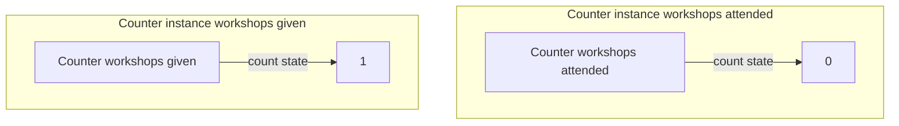

# Hooks

Hooks are the current way to make components a little more useful, they generally allow functional components to have side effects such as keeping state or running side effects after rendering.

For the sake of time and not being too overtly ambitious, within our own React we decided to focus on two of the most used hooks:
- `useState` to allow components to hold state that can be updated and will trigger updates
- `useEffect` to run side effects after render phases

## Anatomy of a hook

Before starting to think about implementation, let's first think a bit about how any hook normally works.
We will take `useState` to make the example a bit more concrete, but for the portion of this chapter none of the elements will be specific to `useState`.

```javascript
// We always import a react hook as a named export from react
import { useState } from 'react';

// Using a hook outside of a component is forbidden
useState(test); // THIS IS ILLEGAL

const Counter = () => {
    // we must use the hook in a react component
    const [count, setCount] = useState(0);
    // hooks have no identification, react relies on order of calling
    const [anotherState, setAnotherState] = useState(0);
    if (anotherState > 0) {
        // which explains the rule of hooks that hooks can't be assign conditionally
        const [yetAnotherState, setYetAnotherState] = useState(0);
    }

    return (
        <div>
            {count}
            <button onClick={() => setCount(count => count + 1)}>+</button>
        </div>
    );
};
```

So the minimal pieces of a hook anatomy are the following:
1. A react hook is exported as a named export by React
2. It must be called in a React component
3. Hooks can't be called conditionally, as React uses the order of calling to keep track of them

Now let's take our `Counter` above and use it in an `App` component to think further about our architecture:

```javascript
const App = () => {
    return (
        <section>
            <div>
                <div>Workshops I attended this year</div>
                <Counter />
            </div>
            <div>
                <div>Workshops I gave this year</div>
                <Counter />
            </div>
        </section>
    )
}
```

This `App` has two categories with a counter, the workshops attended and the workshop given.
Most likely, those two counts are quite different, so while they both use the same component and the same hook `useState` to keep track of their states, each state should be independent!

This adds one more piece of the puzzle to our problem: the state (as in the generic concept of state, not React's one) a hook is in as to be bound to the instance of the component where it is defined.



So to recap our hook anatomy, we can say that a hook is bound to an instance of the Component it is defined in and identified by the index of the hook calls within that component.